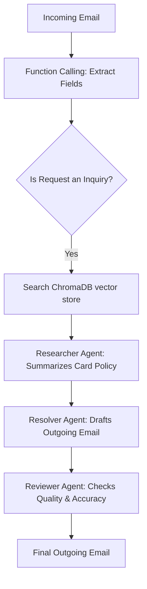
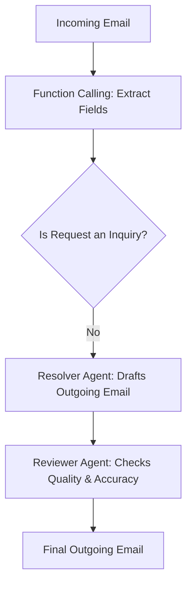

# ADIB Banking Support Copilot

An AI-powered customer support copilot designed for Abu Dhabi Islamic Bank (ADIB) Egypt card services. The system processes incoming customer emails, extracts key metadata, routes requests dynamically based on their category, retrieves policy documents from a local knowledge base (RAG), and produces verified, professional responses using a custom multi-agent workflow.

This project is built from scratch without relying on heavy frameworks like CrewAI or LangGraph, maintaining a lightweight and clean educational structure.

---

## 🚀 Key Features

- **Metadata Extraction (Function Calling):** Automatically identifies the customer's name, request type, card type, and urgency level from incoming emails using schema-bound LLM tool calling.
- **Dynamic Workflow Routing:** Classifies the request type and processes it along two distinct business paths (Inquiry vs. Non-Inquiry).
- **Retrieval-Augmented Generation (RAG):** Uses **ChromaDB** with **SentenceTransformer** embeddings to store and query bank policies locally.
- **Custom Agent Pipeline:** Orchestrates three specific personas (Researcher, Resolver, and Quality Reviewer) built on a lightweight, framework-free `SimpleAgent` class.
- **Unified OpenAI-Compatible Groq Integration:** Interfaces with Groq's super-fast infrastructure using the `ChatOpenAI` and `OpenAI` libraries.

---

## 🛠️ Architecture & Workflows

### 1. SimpleAgent Architecture
The core agent engine is defined by a simple, boilerplate class `SimpleAgent` that accepts:
* `role`: The persona description (e.g., Credit Card Policy Researcher)
* `goal`: What the agent is trying to achieve
* `backstory`: Contextual rules constraining the agent's behavior (e.g., "Never invent information")
* `llm`: The underlying language model

### 2. Request Routing Workflow

Depending on the extracted `request_type`, the pipeline branches automatically:

#### Path A: Card Policy Inquiry (RAG + Multi-Agent)
Used when a customer asks questions regarding bank guidelines (e.g., card activation procedures or cashback rules).


#### Path B: Non-Inquiry Operations
Used for operational requests that do not require document lookup.


---

## 📁 Repository Structure

```
├── .env.example            # Template for environment keys
├── .gitignore              # Ignored files (secrets, virtual environments, caches)
├── knowledge_base.json     # Card policy documents (Activation, Meeza Prepaid, Cashback)
├── requirements.txt        # Project package dependencies
└── main.py                 # Core application script (RAG, Agents, Workflows, CLI runner)
```

---

## ⚙️ Installation & Setup

1. **Clone the Repository:**
   ```bash
   git clone https://github.com/Ahmed-El-shemy/adib_banking_copilotadib_banking_copilot.git
   cd adib_banking_copilotadib_banking_copilot
   ```

2. **Create a Virtual Environment & Install Dependencies:**
   We recommend using `uv` for lightning-fast setups, but you can also use standard `pip`.

   *Using uv:*
   ```bash
   uv venv
   source .venv/bin/activate
   uv pip install -r requirements.txt
   ```

   *Using pip:*
   ```bash
   python3 -m venv .venv
   source .venv/bin/activate
   pip install -r requirements.txt
   ```

3. **Configure Environment Variables:**
   Copy the example environment file and fill in your Groq API key:
   ```bash
   cp .env.example .env
   ```
   Open the `.env` file and set your key:
   ```env
   GROQ_API_KEY=your_actual_groq_api_key_here
   ```

---

## 🏃 Running the Application

Execute the pipeline using python:
```bash
python main.py
```

The script will automatically:
1. Load the card policy data from `knowledge_base.json`.
2. Build and populate the ChromaDB vector database locally.
3. Process two simulated customer emails (one inquiry, one non-inquiry).
4. Run the function extractor, route each request, execute the agent pipelines, and print the resulting drafts at each stage down to the final quality-reviewed outgoing email.
